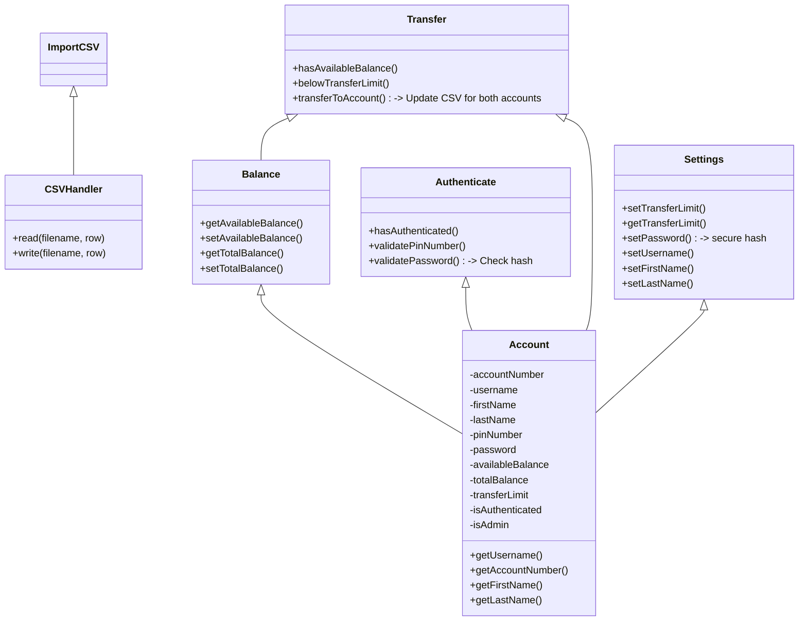

# CSC1109 Project

1. Account Information (e.g. how many accounts, account numbers, etc)
2. Balance Check (e.g. remain balance, available balance, etc)
3. Authentication (e.g. password check / reset, etc)
4. Money Transfer(e.g. inter-account transfer, third-party transfer, etc)
5. Settings (e.g. transfer limit, overseas withdraw limit, etc)

