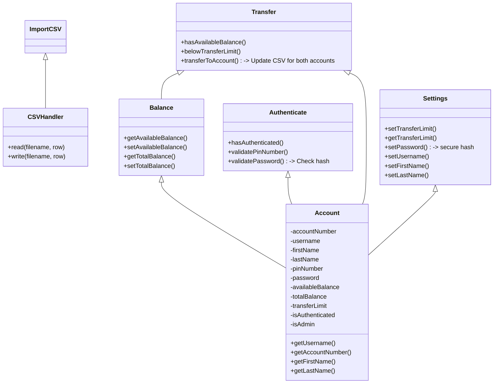

# CSC1109 Project

1. Account Information (e.g. how many accounts, account numbers, etc)
2. Balance Check (e.g. remain balance, available balance, etc)
3. Authentication (e.g. password check / reset, etc)
4. Money Transfer(e.g. inter-account transfer, third-party transfer, etc)
5. Settings (e.g. transfer limit, overseas withdraw limit, etc)

## Dependencies

- Maven
- MySQL

## Setup

1. Install dependencies
2. Connect to MySQL server
  - Create database by `CREATE DATABASE oopasgdb;`
  - Grant user:password to access MySQL database by 
    ```sql
    CREATE USER testAdmin@localhost IDENTIFIED BY 'password1';
    GRANT ALL PRIVILEGES ON oopasgdb.* TO testAdmin@localhost;
    ```
  - Create transactions table by `use oopasgdb;` and
    ```sql
    CREATE TABLE `transactions` (
      `transactionId` varchar(8) NOT NULL,
      `accountNumber` varchar(50) NOT NULL,
      `transactionDate` date NOT NULL,
      `transactionDetails` varchar(100) DEFAULT NULL,
      `chqNumber` varchar(50) DEFAULT NULL,
      `valueDate` date NOT NULL,
      `withdrawal` decimal(15,2) DEFAULT NULL,
      `deposit` decimal(15,2) DEFAULT NULL,
      `balance` decimal(15,2) NOT NULL,
      PRIMARY KEY (`transactionId`)
    ) ENGINE=InnoDB DEFAULT CHARSET=utf8mb4;
    ```
  - Create accounts table
    ```sql
    CREATE TABLE `accounts` (
      `AccountNumber` BIGINT(20) NOT NULL,
      `UserName` VARCHAR(45) NOT NULL,
      `Password` VARCHAR(128) NOT NULL,
      `FirstName` VARCHAR(45) NOT NULL,
      `LastName` VARCHAR(45) NOT NULL,
      `PinNumber`INT(6) NOT NULL,
      `AvailableBalance` FLOAT(45) NOT NULL,
      `TotalBalance` FLOAT(45) NOT NULL,
      `TransferLimit` FLOAT(45) NOT NULL,
      `IsAdmin` SMALLINT(1) NOT NULL,
      PRIMARY KEY (`AccountNumber`)
    ) ENGINE=InnoDB DEFAULT CHARSET=utf8mb4;
    ```

## Setup (Docker)

1. Start sql docker container
  ```shell
  > docker-compose up -d
  ```
2. Connect to sql docker container using `mysql://localhost:4444/oopasgdb`

## Class Diagram


