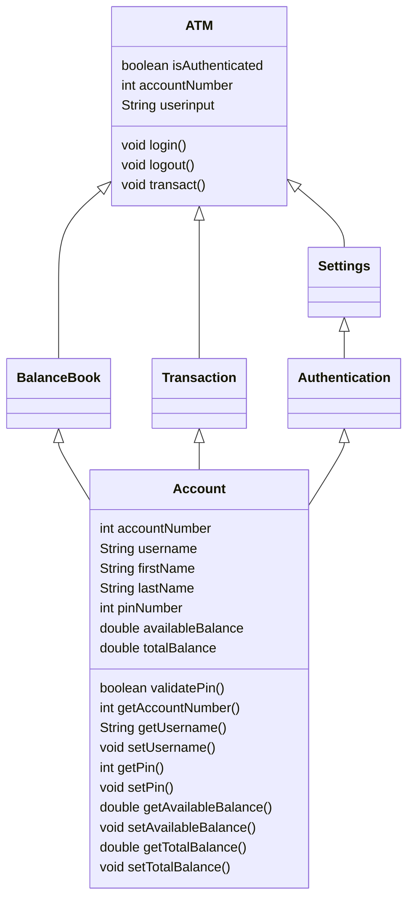

# CSC1109 Project

```mermaid
classDiagram
    ATM <|-- BalanceBook
    ATM <|-- Transaction
    ATM <|-- Settings
    BalanceBook <|-- Account
    Transaction <|-- Account
    Authentication <|-- Account
    Settings <|-- Authentication
    class ATM {
        boolean isAuthenticated
        int accountNumber
        String userinput

        void login()
        void logout()
        void transact()
    }
    class Account {
        int accountNumber
        String username
        String firstName
        String lastName
        int pinNumber
        double availableBalance
        double totalBalance

        boolean validatePin()
        int getAccountNumber()
        String getUsername()
        void setUsername()
        int getPin()
        void setPin()
        double getAvailableBalance()
        void setAvailableBalance()
        double getTotalBalance()
        void setTotalBalance()
    }
    class Transaction {

    }
```
